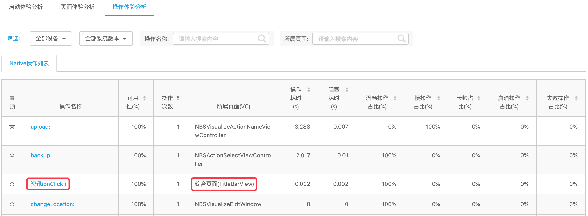

# 可视化命名

## 1、准备工作

嵌入SDK，并把集成SDK的App安装到您的手机。请确保使用已发布的最新版 App 进行“可视化页面命名”，以防因为版本不同，出现数据差异。

#### 注意

* Android
  * 该功能仅支持 Android 5.0 及其以上系统
  * 部分机型使用“可视化页面命名”需要开启“悬浮窗权限”
  * 参考步骤：设置-更多应用-找到您要设置权限的App-权限管理-找到悬浮窗权限-设置为允许

    ```java
    <!--使用可视化操作命名功能需配置悬浮窗权限-->
    <uses-permission android:name="android.permission.SYSTEM_ALERT_WINDOW"/>
    <uses-permission android:name="android.permission.SYSTEM_OVERLAY_WINDOW" />
    ```
* iOS
  * 该功能仅支持 iOS 8.0 及其以上系统

## 2、开始可视化命名

### 2.1 进入可视化命名



#### 进入页面设置


#### 选择可视化命名





#### 进入操作配置


#### 选择可视化操作命名





### 2.2 手机扫描并在浏览器中打开

使用微信或照相机扫码需要在浏览器中打开，浏览器扫码后会打开以下页面，点击“进入应用”即可直接唤起嵌码App（需添加URLScheme）


### 2.3 使用可视化命名

启动可视化命名后，会看到如下界面，点击“悬浮框”可以查看具体功能



1. 点击“悬浮框”，选择“页面命名”    

                   

2. 添加“页面名称”后点击“上传”，看到“上传成功”后已将该页面自动关联后台数据                  
3. 登陆报表平台进行数据校验  





1. 点击“悬浮框”，选择“操作命名”   

                    

2. 拖动“小手图标”至所选操作，在待选操作页面中选择控件所在位置

                    

3. 可以对“操作”及其“所在页面”添加操作名称和页面名称，点击上传看到“上传成功”后已将该页面自动关联后台数据。   

                    

4. 登陆报表平台进行数据校验






1. 点击“悬浮框”，选择“退出可视化命名”即可退出，再次启动需重新扫描二维码   

                    




